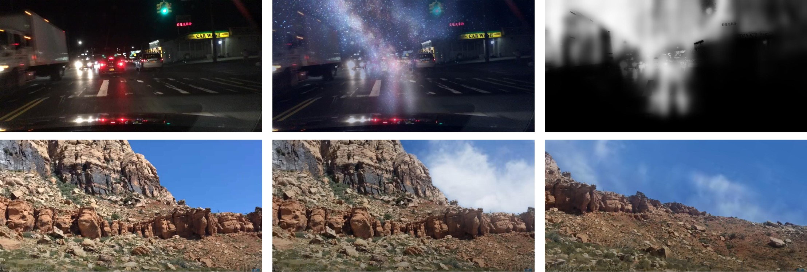

# SkyAR 

[Preprint](<https://arxiv.org/abs/2010.11800>) | [Project Page](<https://jiupinjia.github.io/skyar/>) | [Google Colab](https://colab.research.google.com/github/jiupinjia/SkyAR/blob/main/colab_demo.ipynb) 

### Official Pytorch implementation of the preprint paper "Castle in the Sky: Dynamic Sky Replacement and Harmonization in Videos", in arXiv:2010.11800.

We propose a vision-based method for video sky replacement and harmonization, which can automatically generate realistic and dramatic sky backgrounds in videos with controllable styles. Different from previous sky editing methods that either focus on static photos or require inertial measurement units integrated in smartphones on shooting videos, our method is purely vision-based, without any requirements on the capturing devices, and can be well applied to either online or offline processing scenarios. Our method runs in real-time and is free of user interactions. We decompose this artistic creation process into a couple of proxy tasks including sky matting, motion estimation, and image blending. Experiments are conducted on videos diversely captured in the wild by handheld smartphones and dash cameras, and show high fidelity and good generalization of our method in both visual quality and lighting/motion dynamics.


In this repository, we implement the complete training/testing pipeline of our paper based on Pytorch and provide several demo videos that can be used for reproduce the results reported in our paper. With the code, you can also try on your own data by following the instructions below.

Our code is partially adapted from the project [pytorch-CycleGAN-and-pix2pix](https://github.com/junyanz/pytorch-CycleGAN-and-pix2pix), and the project [Python-Video-Stab](https://github.com/AdamSpannbauer/python_video_stab).


### License
<a rel="license" href="http://creativecommons.org/licenses/by-nc-sa/4.0/"></a><span xmlns:dct="http://purl.org/dc/terms/" property="dct:title">  SkyAR</span> by <a xmlns:cc="http://creativecommons.org/ns#" href="http://www-personal.umich.edu/~zzhengxi/">Zhengxia Zou</a> is licensed under a <a rel="license" href="http://creativecommons.org/licenses/by-nc-sa/4.0/">Creative Commons Attribution-NonCommercial-ShareAlike 4.0 International License</a>.


### One-min video result

[](https://www.youtube.com/watch?v=zal9Ues0aOQ)


## Requirements

See [Requirements.txt](Requirements.txt).


## Setup

1. Clone this repo:

```bash
git clone https://github.com/jiupinjia/SkyAR.git 
cd SkyAR
```

2. Download the pretrained sky matting model from [Google Drive](https://drive.google.com/file/d/1COMROzwR4R_7mym6DL9LXhHQlJmJaV0J/view?usp=sharing), and unzip into the repo directory.

```bash
unzip checkpoints_G_coord_resnet50.zip
```

   


## To produce our results

#### District 9 Ship ([video source](https://www.youtube.com/watch?v=forZrqljb88))


```bash
python skymagic.py --path ./config/config-canyon-district9ship.json
```

#### Super-moon on Ann Arbor


```bash
python skymagic.py --path ./config/config-annarbor-supermoon.json
```

#### Config your settings

If you want to try on your own data, or want a different blending style, you can config the .json files in the ./config directory. The following we give a simple example of how the parameters are defined. 

```json
{
  "net_G": "coord_resnet50",
  "ckptdir": "./checkpoints_G_coord_resnet50",

  "input_mode": "video",
  "datadir": "./test_videos/annarbor.mp4",
  "skybox": "floatingcastle.jpg",

  "in_size_w": 384,
  "in_size_h": 384,
  "out_size_w": 845,
  "out_size_h": 480,

  "skybox_center_crop": 0.5,
  "auto_light_matching": false,
  "relighting_factor": 0.8,
  "recoloring_factor": 0.5,
  "halo_effect": true,

  "output_dir": "./eval_output",
  "save_jpgs": false
}
```


## Google Colab

Here we also provide a minimal working example of the inference runtime of our method. Check out [](https://colab.research.google.com/github/jiupinjia/SkyAR/blob/main/colab_demo.ipynb) and see your result on Colab.


## To retrain your sky matting model

Please note that if you want to train your own model, you need to download the complete [CVPRW20-SkyOpt dataset](https://github.com/google/sky-optimization). We only uploaded a very small part of it due to the limited space of the repository. The mini-dataset we included in this repository is only used as an example to show how the structure of the file directory is organized. 

```bash
unzip datasets.zip
python train.py \
	--dataset cvprw2020-ade20K-defg \
	--checkpoint_dir checkpoints \
	--vis_dir val_out \
	--in_size 384 \
	--max_num_epochs 200 \
	--lr 1e-4 \
	--batch_size 8 \
	--net_G coord_resnet50
```


## Limitations

The limitation of our method is twofold. First, since our sky matting network is only trained on daytime images, our method may fail to detect the sky regions on nighttime videos. Second, when there are no sky pixels during a certain period of time in a video, or there are no textures in the sky, the motion of the sky background cannot be accurately modeled. 

The figure below shows two failure cases of our method. The top row shows an input frame from [BDD100K](https://bair.berkeley.edu/blog/2018/05/30/bdd/) at nighttime (left) and the blending result (middle) produced by wrongly detected sky regions (right). The second row shows an input frame (left, [video source](https://www.youtube.com/watch?v=eK4KqeTFqEA)), and the incorrect movement synchronization results between foreground and rendered background (middle and right).




## Citation

If you use this code for your research, please cite our paper:

``````
@inproceedings{zou2020skyar,
    title={Castle in the Sky: Dynamic Sky Replacement and Harmonization in Videos},
    author={Zhengxia Zou},
    year={2020},
    journal={arXiv preprint arXiv:2010.11800},
}
``````


